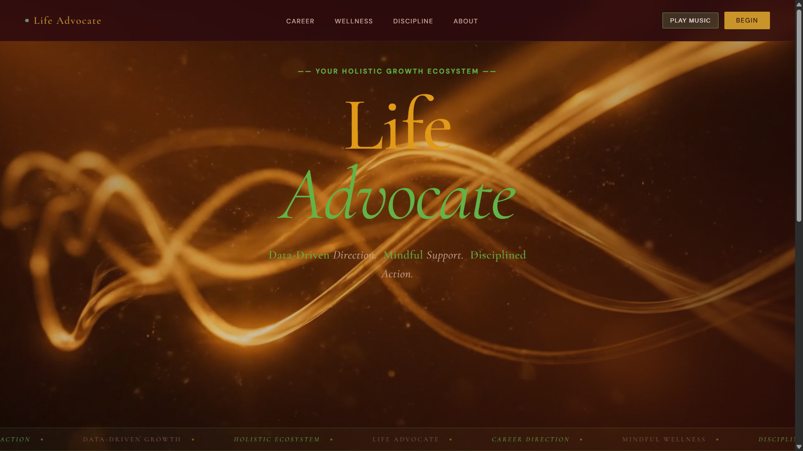
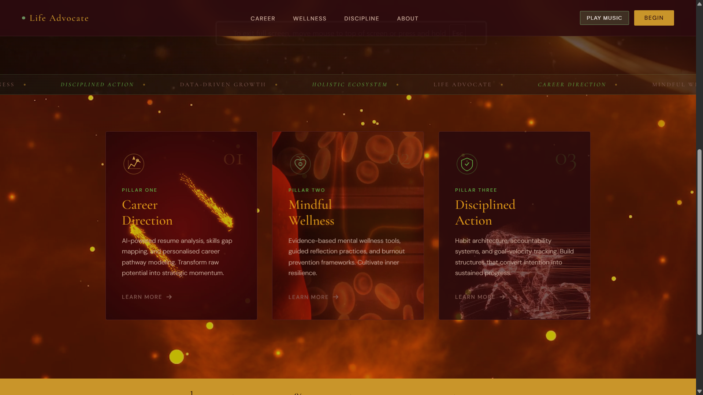

# Project Overview

This project is a PHP-based website built around user registration and login, with a simple session-driven authentication flow. It uses a MySQL database for storing user accounts and includes multiple content pages such as career, discipline, and wellness sections, along with roadmap pages for different professions.

The application is designed to run in a local Apache/PHP environment such as XAMPP. The authentication logic is handled in PHP, while the user interface is built with HTML, CSS, and a small amount of JavaScript where needed. The project also includes background media assets to support the visual design of the login and registration pages.

##  Tech Stack
-  **HTML5**
-  **CSS3**
-  **JavaScript**
-  **PHP**
-  **MySQL**
-  **Apache (via XAMPP)**

## Main Features

- User registration and login
- Session-based authentication
- Database-backed user accounts
- Career, discipline, and wellness content pages
- Profession roadmap pages
