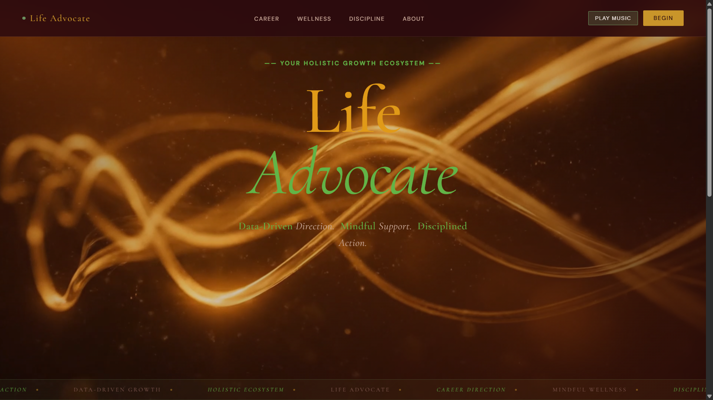
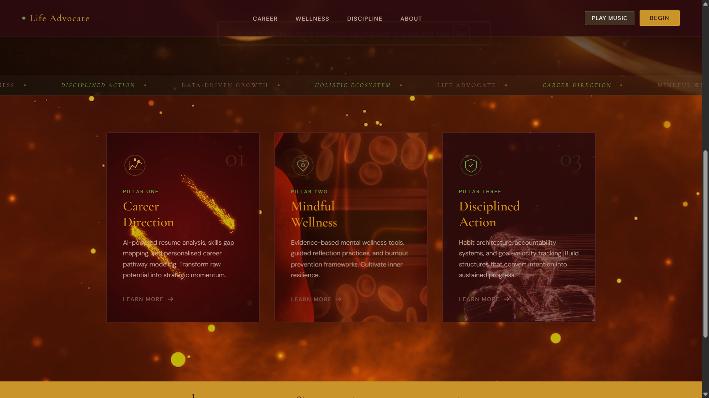

# Life Advocate

Life Advocate is a PHP + MySQL web application focused on three pillars:
- **Career** guidance with roadmap pages for multiple professions
- **Wellness** support through an AI companion chat
- **Discipline** through a daily task manager

It includes user registration/login and session-based access to authenticated features.




## Security Warning

This project is currently educational/demo-oriented and is **not production-ready** in its current authentication form (MD5 password hashing in `server.php`).
Before production use, migrate to modern password hashing (`password_hash()` / `password_verify()`), secure secret management, and a full security review.

## Tech Stack

- HTML5
- CSS3
- JavaScript (vanilla)
- PHP
- MySQL
- Apache (recommended via XAMPP)

## Features

- User registration and login (`register.php`, `login.php`)
- Session authentication (`server.php`, `index.php`)
- Career pathways and roadmap pages (`career.html`, `roadmaps/*`)
- Wellness AI chat (`wellness.html`, `wellness.js`, `wellness_api.php`)
- Daily task manager with date-based tasks (`discipline.html`, `discipline.js`, `discipline_api.php`)

---

## Project Structure

```text
Life-Advocate/
├── login.php
├── register.php
├── server.php
├── index.php
├── index.html
├── stylehome.css
├── scripthome.js
├── career.html
├── career.css
├── careerimages/
├── wellness.html
├── wellness.css
├── wellness.js
├── wellness_api.php
├── discipline.html
├── discipline.css
├── discipline.js
├── discipline_api.php
├── roadmaps/
├── assets/
└── README.md
```

---

## Prerequisites

Before running locally, install:

- **XAMPP** (or another Apache + PHP + MySQL stack)
- PHP with **mysqli** and **cURL** enabled
- A MySQL/MariaDB server

---

## Setup Guide (Local)

### 1) Place the project in your web root

For XAMPP:
- Windows: `C:\xampp\htdocs\Life-Advocate`
- macOS/Linux: `/Applications/XAMPP/htdocs/Life-Advocate` (or equivalent)

### 2) Start Apache and MySQL

Use your XAMPP control panel (or system service manager) to start both services.

### 3) Create the database

This project expects the database name:

```sql
ap project
```

You can create it in phpMyAdmin or with SQL:

```sql
CREATE DATABASE `ap project`;
```

> Note: the project currently uses a database name with a space (`ap project`) in PHP connection code, so keep this exact name unless you also update the PHP files.

### 4) Create required tables

Run the following SQL in the `ap project` database:

```sql
CREATE TABLE IF NOT EXISTS users (
  id INT AUTO_INCREMENT PRIMARY KEY,
  username VARCHAR(255) NOT NULL UNIQUE,
  email VARCHAR(255) NOT NULL UNIQUE,
  password VARCHAR(255) NOT NULL
);

CREATE TABLE IF NOT EXISTS daily_tasks (
  id INT AUTO_INCREMENT PRIMARY KEY,
  user_key VARCHAR(255) NOT NULL,
  task_date DATE NOT NULL,
  task_text VARCHAR(255) NOT NULL,
  is_done TINYINT(1) NOT NULL DEFAULT 0,
  created_at TIMESTAMP NOT NULL DEFAULT CURRENT_TIMESTAMP,
  INDEX idx_user_date (user_key, task_date)
);
```

### 5) Configure database credentials (if needed)

By default, PHP files connect with:
- host: `localhost`
- user: `root`
- password: *(empty)*
- database: `ap project`

If your local MySQL credentials differ, update:
- `server.php`
- `discipline_api.php`

### 6) Configure Wellness API key

Recommended approach in `wellness_api.php`:

```php
$apiKey = getenv('GROQ_API_KEY');
if (!$apiKey) {
  die('GROQ_API_KEY environment variable is not set. Configure it in Apache/.htaccess.');
}
```

Then set `GROQ_API_KEY` in your local server environment.

Example (Apache vhost or `.htaccess` where allowed):

```apache
SetEnv GROQ_API_KEY "your-real-key"
```

If you still choose quick local testing with a hardcoded value, use a placeholder like `YOUR_GROQ_API_KEY_HERE` and never commit a real key.

For safer setup, do not hardcode secrets in source. Prefer loading from environment/config (for example, `getenv('GROQ_API_KEY')`) and keep local secret files out of Git.

> Keep keys private. Do not commit real secrets to Git.

### 7) Open the app

Visit:

```text
http://localhost/Life-Advocate/login.php
```

If your local folder name is different, replace `Life-Advocate` in the URL with your actual project directory name.

Register a user, sign in, then explore:
- Home: `index.html` (or go through `index.php` for login-gated redirect behavior)
- Career: `career.html`
- Wellness: `wellness.html`
- Discipline: `discipline.html`

---

## Basic Validation

To validate PHP syntax from the repository root:

```bash
for f in *.php; do php -l "$f"; done
```

---

## Troubleshooting

- **Database connection failed**
  - Ensure MySQL is running
  - Confirm database name is exactly `ap project`
  - Verify credentials in `server.php` and `discipline_api.php`

- **Cannot use Discipline tasks**
  - Make sure you are logged in first
  - Confirm `daily_tasks` table exists

- **Wellness assistant fails**
  - Add a valid Groq API key in `wellness_api.php`
  - Confirm PHP cURL extension is enabled

---

## Notes

- Passwords are currently stored using MD5 hashing in `server.php`.
- MD5 is not secure for password storage; migrate to `password_hash()` / `password_verify()` before any real-world deployment.
